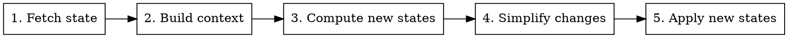

# maestro
Home assistant lights orchestrator

## Running the server

Build and run the executable with Swift Package Manager. You can provide the
Home Assistant base URL and an optional long‑lived access token. There is also
an option to simulate light commands instead of sending them:

```bash
swift run maestro --baseurl http://homeassistant.local:8123/ --token YOUR_TOKEN
swift run maestro --simulate # Log light actions without changing anything
# Select a different light program
swift run maestro --program secondary
```

The package builds on Linux and macOS. On macOS the POSIX server code uses the
`Darwin` module, so the same command works there as well.

- `--baseurl` – base URL for the Home Assistant instance. The default is
  `http://homeassistant.local:8123/`.
- `--token` – long lived Home Assistant token used for API calls. If omitted the
  requests are sent without authentication.
- `--simulate` – print light commands to stdout instead of sending them.
- `--program` – choose the light program to run (`default` or `secondary`).

## HTTP API

The server exposes a single `GET` endpoint on `/run` with no parameters.

Example request:

```bash
curl http://localhost:8080/run
```

If the path is anything other than `/run`, the server responds with `404 Not
Found`.

## Process Overview

`Maestro` executes the light orchestration through a small pipeline. Each part
is provided by a dedicated protocol-based component, which makes the design
easy to extend or swap out. The process is composed of five steps:

1. **Fetch state** – the `HomeAssistantStateProvider` retrieves the current Home
   Assistant states.
2. **Build context** – these raw states are transformed into a `StateContext`
   describing the active scene and environment.
3. **Compute new states** – the chosen `LightProgram` decides the desired light
   states based on the context.
4. **Simplify changes** – `LightStateSet` removes transitions that do not change
   the current state.
5. **Apply new states** – the `LightController` sends the resulting commands to
   Home Assistant (or just logs them when simulation is enabled).

Below is a diagram of the flow:



## Compiling on macOS

See [docs/compile-macos.md](docs/compile-macos.md) for instructions on building
this package using Swift Package Manager on macOS.
